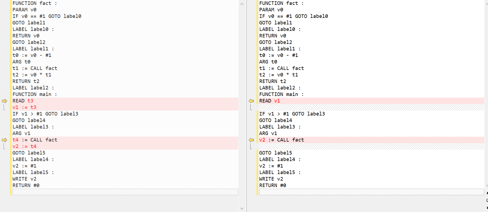

## 基础功能

没什么好说的，见代码。

## 优化

对于由单个`spl`源代码文件生成的一组ir，我们维护如下数据结构：

- 操作符使用记录：维护在`SplIrModule`的成员`use_list`中，记录每个`SplIrOperand`被哪些`SplIrInstruction`使用（类似于`llvm`里的`Value`和`User`）。
- 基本块与控制流图：`SplIrBasicBlock`的成员`head`记录其首指令；成员`predecessors`和`successors`记录其前驱和后继，构成控制流图。我们只考虑过程（函数）内的控制流跳转而不考虑过程（函数）间的控制流跳转。

### Dead Basic Block Elimination

某个（些）基本块可能无法被到达，我们可以从ir中移除该基本块。判断这类基本块的条件是，该基本块没有前驱且首指令不为函数定义指令。理论上还可以加入对过程间控制流的维护，从而实现进一步的优化，将不被调用的过程（函数）整个移除；实现上只需要根据函数调用指令添加控制流边信息，并且不允许除`main`函数的函数定义指令所在的基本块以外的基本块没有前驱，否则将其移除。样例中没有这类定义了函数而不调用的情况，所以我们没有实现这种过程间的优化。

下面是基本块消除的一个具体例子

下图为优化前的基本块与控制流信息

下图为优化后的基本块与控制流信息

### Copy Propagation Elimination

我们只对一种简单的复制传播的场景做优化，即存在连续的两条指令，第一条指令为一个临时变量（在源代码中不存在，在ir中作为表达式的中间产物，我们保证这类变量只被定义一次，但没有保证源代码中的变量在ir中对应的变量只被定义一次，因此我们的ir不是SSA的（如果要做SSA似乎得自己加`phi`指令，感觉好麻烦放弃了））赋值，而第二条指令将该临时变量赋值给另一个变量，且该临时变量仅有上述两处使用。这种场景保证了前一条指令总是后一条指令的reaching definition，并且该临时变量可以被简单地替换而不破坏正确性。对这种场景，我们将第一条指令中对该临时变量的使用替换成第二条指令中被赋值的变量的使用，然后移除第二条指令。

下面是复制传播消除的一个具体例子

### Fall Through

我们对这样一种场景做优化，即存在连续的三条指令，第一条指令为条件跳转指令，且跳转目标为第三条指令，第三条指令为标号（label）指令且仅由第一条指令跳转到，第二条指令为无条件跳转指令，且跳转目标不为第三条指令。对这种场景，我们对第一条指令的跳转条件取反，跳转目标替换成第二条指令的跳转目标，然后移除第二条和第三条指令。

下面是这种优化的一个具体例子

## Bonus功能

没什么好说的，见代码。

### 结构体及其传参支持

样例输入输出见`test-ex/test_a*`，输入使用的是官方测试结构体及其传参支持的`sample`样例。

### 数组及其传参支持

样例输入输出见`test-ex/test_b*`，输入使用的是官方测试数组及一维数组传参支持的`sample`样例。

